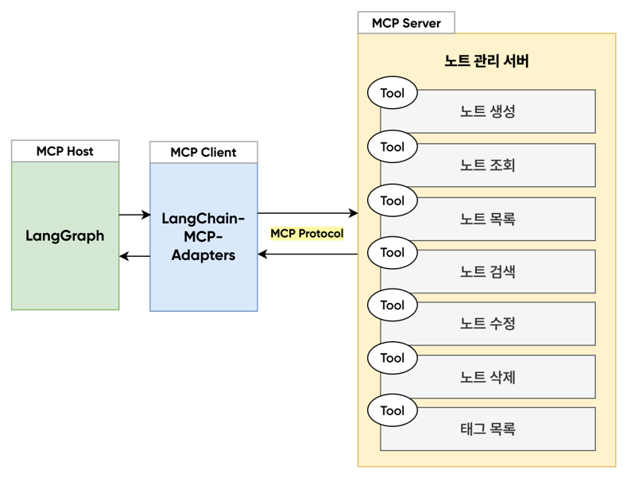

# MCP Tool 기반 Agent



1. **로컬 MCP 서버** (`notes_client.py`)
   - 로컬 Python 프로세스로 MCP 서버 실행
   - `notes_server.py`를 subprocess로 자동 실행
   - 커스텀 도구 구현

2. **원격 MCP 서버** (`remote_langchain_docs_client.py`)
   - 이미 운영 중인 원격 서버에 HTTP 연결
   - **별도 서버 실행 불필요**
   - LangChain 공식 문서 검색


## 방법 1: 로컬 MCP 서버 (개인 메모 관리)

### 실행

```bash
python notes_client.py
```

**참고**: `notes_client.py` 내부에서 `StdioServerParameters`로 `notes_server.py`를 subprocess로 자동 실행하므로 별도로 서버를 실행할 필요가 없습니다.

### 실습 예시

> - https://examples.com 링크 메모에 저장해줘.
> - 모든 노트 목록 보여줘
> - '업무' 태그가 있는 노트만 보여줘
> - "신제품 아이디어"라는 노트를 만들어줘. 태그는 '아이디어', '브레인스토밍'


## 방법 2: 원격 MCP 서버 (LangChain 문서)

### 원격 서버 연결 방식

로컬에서 서버를 실행하지 않고, 이미 운영 중인 원격 MCP 서버에 **HTTP/HTTPS**로 연결합니다.

- **원격 서버 예시**: LangChain 공식 문서 서버
  - 안내 페이지: `https://docs.langchain.com/use-these-docs`
  - 실제 MCP 서버 URL: `https://docs.langchain.com/mcp`
  - 제공 기능: LangChain 문서 검색 및 조회

- **Client** (`remote_langchain_docs_client.py`):
  - `MultiServerMCPClient`로 원격 서버 연결

### 실행

```bash
python remote_langchain_docs_client.py
```

### 실습 예시

> - LangGraph의 특징에 대해 알려주세요.
> - 랭체인의 create_agent 사용법(파이썬) 알려주세요.
> - 랭체인을 처음 사용하는 사람이 읽으면 좋은 문서는?
> - langchain-openai 사용법 알려주세요.


