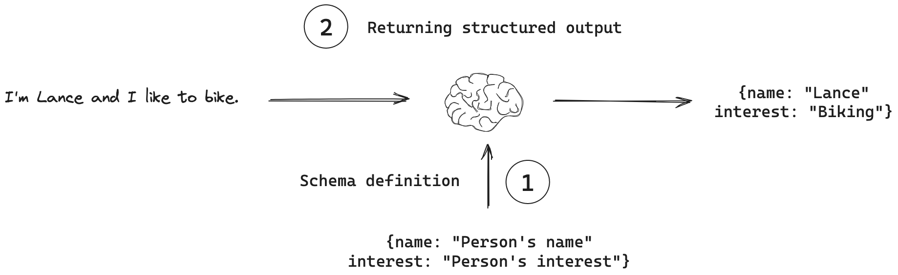

# 02 검색 문서의 관련성 검증을 추가한 RAG

검색된 문서가 사용자 질문과 관련이 있는지 평가하고, 관련성이 낮으면 질문을 재작성하는 RAG 시스템입니다.


## with_structured_output 이해하기



**Structured Output**은 LLM의 응답을 정해진 형식으로 받는 기능입니다.

## 파일 구조

```
02_relevance_grading_rag/
├── state.py           # Graph State 정의
├── retriever.py       # Retriever 설정
├── prompts.py         # 프롬프트 정의
├── nodes.py           # 노드 함수들
├── graph.py           # 그래프 구성
├── __init__.py        # 패키지 초기화
├── langgraph.json     # LangGraph Studio 설정
└── .env.example       # 환경변수 예시
```

## 실행 방법

### LangGraph Studio 실행

```bash
# 02_relevance_grading_rag 폴더로 이동
cd 02_relevance_grading_rag

# LangGraph Studio 실행
uv run langgraph dev
```