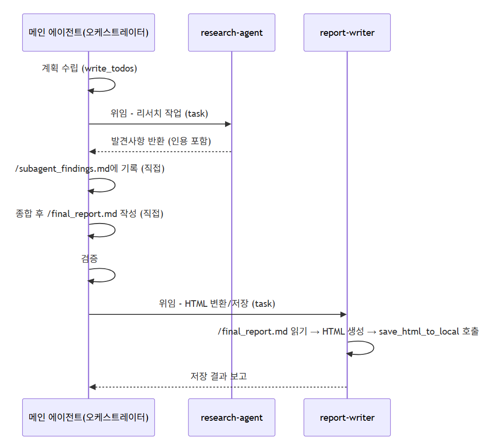

# Deep Research Agent



## 랭그래프 스튜디오 실행

```bash
cd Day4/deep_research
```

```bash
uv run langgraph dev --no-reload --allow-blocking
```

## 예시 질문

- AI 에이전트 구축에 사용되는 컨텍스트 엔지니어링에 대해 조사해줘
- AI Agent의 Harness Engineering 의 개요를 알려줘
- LangChain의 Deep Agents에 대해 조사해주세요.
- AI Agent의 그래프 엔지니어링에 대해 정리해주세요.